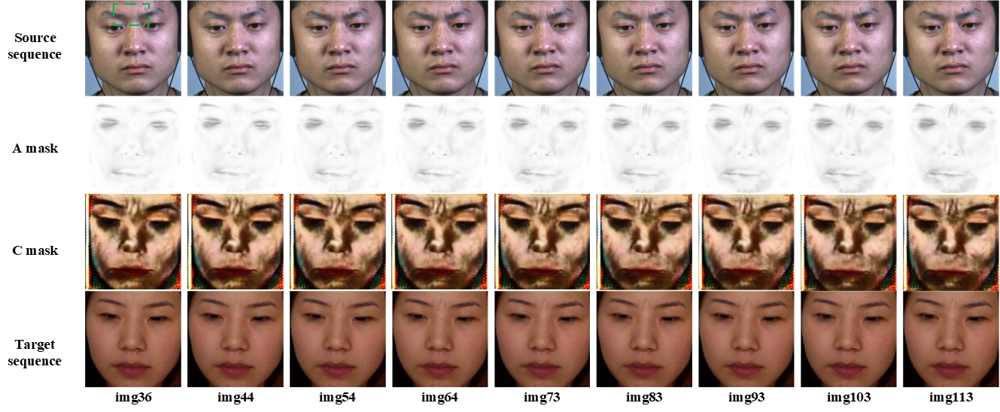
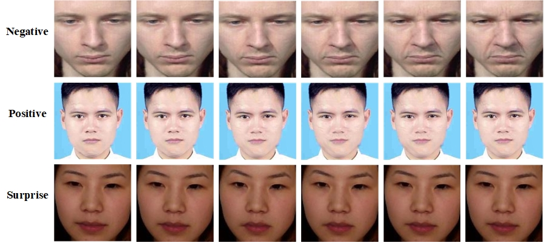

# Micro Expression Generation for MEGC2021

This project is for Facial Micro-Expression (FME) Workshop and Challenge 2021 - Facial micro-expression generation task.Link:[MEGC2021](https://megc2021.github.io/index.html)

## Citation
If you find this work useful for your research,please cite our paper:

## Method
For details, please refer to the above paper. The follwing briefly summarize our work here.
- 1.Using AU matrix re-encoded
- 2.The model has a good generation effect
- 3.Adopting transfer learning
- 4.Linear fitting of image sequence
- 5.The input target expression can be the AU matrix or face image of any expression state 

## Results
Our generation has achieved good results.
The results of MEGC2021 in ../MEGC2021_results and The more results(no_recode,just_AU_recode,recode_apex_frame and expert_opinion) in [Google Drive](https://drive.google.com/drive/folders/1ZAJsFgZ5LG0Fy26DkOZNf0ZaoIKAq7aa?usp=sharing) or [BaiduNetdisk](https://pan.baidu.com/s/1hi0dyAWvedCgxy5tZm0erA)(Code:72xv)
The following gifs is the result of paper,for the convenience of display,a.gif is the result without AU matrix re-encoded,b.gif is the result just after AU matrix re-encoded and c.gif is the result after Au matrix re-encoded and linear-fitting.


&emsp;&emsp;&emsp;&emsp;&emsp;&emsp;&emsp;a.gif&emsp;&emsp;&emsp;&emsp;&emsp;&emsp;&emsp;&emsp;&emsp;&emsp;&emsp;&emsp;&emsp;&emsp;b.gif&emsp;&emsp;&emsp;&emsp;&emsp;&emsp;&emsp;&emsp;&emsp;&emsp;&emsp;&emsp;&emsp;&emsp;&emsp;c.gif

Our generaters consists of two parts：Attention mask generator and Color intensity extraction.We show A and C in the figure below.



We can also generate consistent images on the template face according to the input Au matrix or image of any state.



## reproduce
Note: Windows system only

### Required Package:
    python	3.7.6
    torch	1.0.0
    torchvision  0.2.0
    numpy	  1.18.1
    pillow	  7.1.2
    opencv	  4.2.0
    visdom   0.1.8.9(Optional,just train)
    pandas   1.0.4
    tqdm      4.42.1
you can Install requirements.txt (pip install -r requirements.txt) to install the above Package
### Data Preparation
The code requires a directory containing the following files:
To train:
- `imgs/`: folder with all training image

To test:
- `imgs/`: folder with the source expression image
- `imgs2/`: folder with the target image

When you have a au tense table The following are needed
- `aus_openface.pkl`: it's every line contains filename,AU1,AU2,AU4,AU5,AU6,AU7,AU9,AU10,AU12,AU14,AU15,AU17,AU20,AU23,AU25,AU26 and AU45
- `test_ids.csv`: each line is the image file name, including the expression and template face


### Train and Test
To train
```
python main.py --data_root [data_path] --gpu_ids [-1,0,1,2...] --visdom_display_id [0,1]
# e.g. python main.py --data_root datasets\train_data --gpu_ids 0 --sample_img_freq 500 --pre_treatment --visdom_display_id 0
```
To test
our model,coding tools and trained model all in [Google Drive](https://drive.google.com/file/d/16nc7c7JFoEVZ6EEqeYdXyMszP5-sBx-4/view?usp=sharing) or [BaiduNetdisk](https://pan.baidu.com/s/12EUNgbIoNCNLG96C1lsX4g)(Code:vtw2),after decompression, put ckpts and openface directly into the directory of ULME-GAN
```
python main.py --mode test --data_root [data_path] --batch_size [num] --max_dataset_size [max_num]
   --gpu_ids [-1,0,1,2...] --ckpt_dir [ckpt_dir] --load_epoch [num] [--serial_batches] --n_threads [num] [--linear_fitting|--apex_frame] [--pre_treatment] [--re_code] [--save_video]
#if you have AU tense table ,please enter the followed command
# e.g. python main.py --mode test --data_root test/casme2_Negative_asianFemale --batch_size 128 --max_dataset_size 9999 --gpu_ids -1 --ckpt_dir ckpts\ULMEGAN\210619_212934/ --load_epoch 40 --n_threads 0  --save_video
#if you want get a MEGC2021 Micro Expression Generation result,please enter the followed command
# e.g. python main.py --mode test --data_root test/casme2_Negative_asianFemale --batch_size 128 --max_dataset_size 9999 --gpu_ids -1 --ckpt_dir ckpts\ULMEGAN\210619_212934/ --load_epoch 40 --serial_batches --n_threads 0 --linear_fitting --pre_treatment --re_code --save_video
#if you want get all MEGC2021 Micro Expression Generation results,please enter the followed command
# e.g. python for_megc2021.py
The output file will be written into results folder.
```
To finetune
```
python main.py --data_root [data_path] --gpu_ids [-1,0,1,2...] --ckpt_dir [ckpt_dir] --load_epoch [num] --epoch_count [num] --niter [num] --niter_decay [num]
# e.g. python main.py --data_root weitiao --gpu_ids 0 --sample_img_freq 300 --n_threads 0 --ckpt_dir ckpts\ULMEGAN\210619_212934 --load_epoch 40 --epoch_count 41 --niter 40 --niter_decay 10
```
